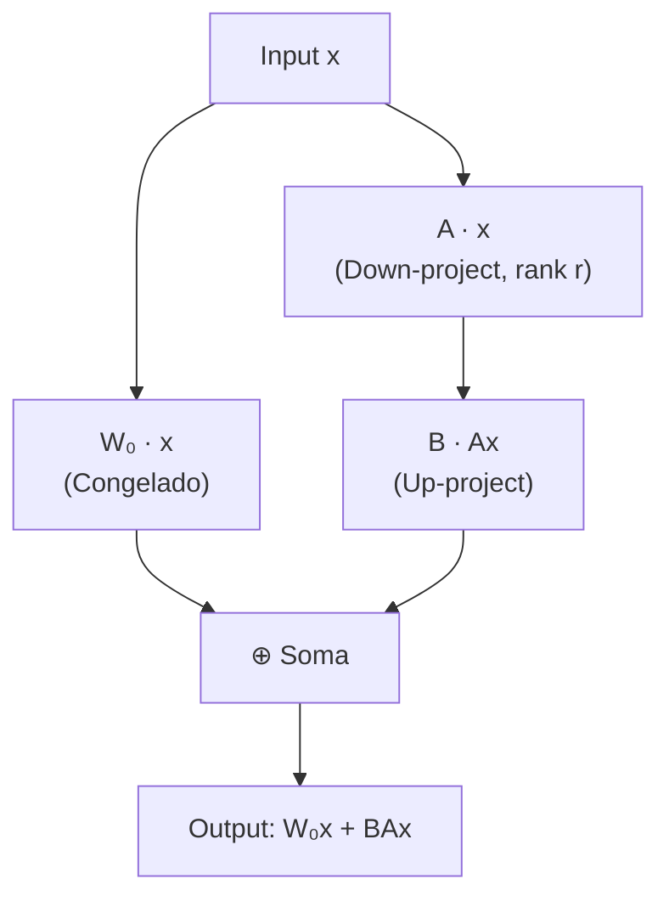

# Adaptando Modelos de Fundação

## 🎯 O que é Adaptação?

**Adaptação**, no contexto de modelos de fundação, refere-se ao processo de personalização desses sistemas abrangentes de IA para melhor se adequarem a aplicações específicas ou para incorporar informações atualizadas. Isso é crucial para aproveitar todo o potencial dos modelos para tarefas ou domínios particulares. A adaptação pode ser alcançada ajustando (**fine-tuning**) ou re-treinando um modelo de fundação pré-treinado com novos dados. Essa adaptação sob medida não apenas aprimora o desempenho do modelo em tarefas especializadas, mas também o mantém atualizado.

Existem dois tipos principais de adaptação:

* **Otimização para Tarefas Específicas:** Adaptação de um modelo de fundação para otimizar o desempenho em uma tarefa muito específica, como a estruturação de dados para prontuários eletrônicos de saúde, onde o modelo é treinado para extrair ideias-chave de registros médicos digitalizados e organizá-los.
* **Adaptação Geral Baseada em Instruções:** Utiliza dados de fontes instrucionais (manuais ou conjuntos de dados curados) para ajustar o modelo, permitindo-lhe ter um desempenho ainda melhor em tarefas não vistas e não antecipadas.

---

## ❓ Por que Precisamos Adaptar os Modelos de Fundação?

Embora os modelos de fundação tenham alterado radicalmente o campo da PNL ao mudar o foco de arquiteturas específicas para tarefas para sistemas mais generalizados e adaptáveis, e demonstrem versatilidade excepcional através do aprendizado por transferência e da capacidade de processar vastas quantidades de dados eficientemente, ainda existe uma necessidade de adaptá-los a casos de uso específicos para garantir que sejam otimizados para a tarefa em questão. As principais razões incluem:

* **Necessidade de Dados Atualizados:** O mundo está em constante mudança, e os modelos de base, por mais abrangentes que sejam, não podem ser re-treinados continuamente com os dados mais recentes. A adaptação permite que eles incorporem informações atualizadas para evitar a produção de informações desatualizadas ou imprecisas.
* **Foco no Domínio Específico:** Os modelos de base são treinados em dados gerais da internet, o que os torna bons em tarefas gerais. No entanto, para domínios específicos (como medicina, direito ou finanças), eles podem não ter o conhecimento aprofundado ou a capacidade de raciocínio necessários. A adaptação permite que eles se tornem especialistas em um determinado domínio.
* **Melhor Desempenho e Eficiência:** Modelos adaptados podem atingir maior precisão e eficiência em tarefas específicas, superando o desempenho de modelos não adaptados.

---

## 🔍 Geração Aumentada por Recuperação (RAG)

A **Geração Aumentada por Recuperação (RAG)** combina a capacidade de geração de um LLM com a recuperação de informações de uma base de conhecimento externa.


Benefícios da RAG:
* **Manter a Atualidade** — Responde a perguntas sobre eventos recentes sem re-treinamento
* **Reduzir Alucinações** — Fundamenta respostas em informações recuperadas
* **Domínio Específico** — Acessa bases de conhecimento que não fizeram parte do treinamento

---

## 📝 Técnicas de Design de Prompt

As **técnicas de design de prompt** guiam modelos de base em direção a comportamentos e funcionalidades desejados.

| Técnica | Exemplos Fornecidos | Quando Usar |
|---|---|---|
| **Zero-Shot** | 0 | Tarefa simples, modelo já tem conhecimento suficiente |
| **One-Shot** | 1 | Quando há um exemplo disponível |
| **Few-Shot** | 2–5 | Tarefas complexas que requerem padrão a seguir |
| **Chain-of-Thought** | 1+ (com raciocínio) | Problemas que exigem raciocínio em etapas |

| Tipo de Prompt | Característica | Vantagem |
|---|---|---|
| **Hard Prompt** | Texto legibível por humanos, manual | Fácil de iterar e ajustar |
| **Soft Prompt** | Vetores otimizados via deep learning | Desempenho superior na direção do LLM |

> 💡 **Chain-of-Thought:** Ao solicitar que o modelo "pense passo a passo", decompondo problemas complexos em etapas lógicas, melhora significativamente a precisão em tarefas de raciocínio.

---

## 📊 Melhorando Consultas com Chain-of-Thought

> 💡 **Dica:** Ao solicitar que o modelo "pense passo a passo" ou "explique o raciocínio" antes da resposta final, mesmo tarefas complexas de raciocínio e computação podem ser otimizadas.

---

## 🔬 Probing: Adaptando com Rede Classificadora

**Probing** é uma técnica dentro do campo de Machine Learning e IA usada para adaptar modelos de base para várias tarefas. Uma técnica comum é o **Linear Probing**, que consiste em anexar uma pequena rede neural a alguns dos nós de um grande modelo de linguagem e treiná-la para completar uma tarefa específica.

Um exemplo prático é usar um modelo como o **BERT**. A saída do modelo é uma codificação da mensagem original como um tensor. Ao conectar uma pequena rede neural (a "**cabeça de classificação**") a essa camada final do BERT, podemos treinar essa rede para classificar a entrada de acordo com uma tarefa específica, como análise de sentimento usando um conjunto de dados rotulado (por exemplo, o dataset IMDB de avaliações de filmes e rótulos de sentimento). Se assumirmos que o BERT já possui essa informação codificada em sua camada final, podemos "congelar" os parâmetros do modelo para que não mudem, permitindo que apenas a cabeça de classificação seja alterada durante o treinamento.

---

## 🔧 Fine-Tuning Tradicional

**Fine-tuning** é uma fase crucial no ciclo de vida dos modelos de base, envolvendo o treinamento do modelo em dados adicionais para alterar seus parâmetros e adaptá-lo a um caso de uso específico. Em contraste com o probing, que foca em treinar apenas uma pequena "cabeça" ou camada, o fine-tuning tradicional atualiza os parâmetros ou pesos reais de todo o modelo pré-treinado.

Embora o fine-tuning melhore a capacidade do modelo de se adaptar a tarefas mais especializadas ou conjuntos de dados, ele apresenta desafios significativos:

* **Alto Custo Computacional:** Fine-tuning requer poder computacional substancial, muitas vezes na mesma escala que o treinamento inicial do modelo. Isso se deve ao grande número de parâmetros que precisam ser ajustados.
* **Armazenamento:** Os parâmetros do modelo devem ser armazenados, e se um grande modelo de base for ajustado por muitos usuários individuais, cada versão ajustada precisará ser armazenada, o que compromete a ideia de modelos de base reutilizáveis.
* **Dados Fora da Distribuição (Out-of-Distribution Data):** O fine-tuning tradicional pode distorcer as representações internas aprendidas pelo modelo quando confrontado com dados que são muito diferentes daqueles em que foi originalmente treinado. Isso pode levar a um desempenho ruim em dados novos e não vistos.

---

## ⚡ Fine-Tuning Eficiente em Parâmetros (PEFT) e LoRA

| Técnica | O que atualiza | Custo Computacional | Caso de Uso |
|---|---|---|---|
| **Probing** | Apenas a "cabeça" classificadora | Muito baixo | Classificação sobre repr. fixas |
| **Fine-Tuning** | Todos os parâmetros do modelo | Altíssimo | Máxima adaptação ao domínio |
| **PEFT (Adapters)** | Apenas adaptadores inseridos | Baixo | Equilíbrio entre custo e performance |
| **LoRA** | Matrizes de baixo posto inseridas | Muito baixo | Fine-tuning eficiente em produção |

> 🔴 **Fine-Tuning Tradicional:** Alto custo computacional, alto armazenamento (uma cópia do modelo por usuário) e risco de distorcer representações internas.

**LoRA (Low-Rank Adaptation)** é a técnica PEFT mais popular:



$$W = W_0 + BA$$

Onde $W_0$ são os pesos originais congelados, $B$ e $A$ são matrizes de baixo posto treináveis ($\text{rank} \ll d$). Apenas $B$ e $A$ são atualizadas durante o treinamento.

```python
from peft import LoraConfig, get_peft_model
from transformers import AutoModelForSequenceClassification

# Carrega modelo base
base_model = AutoModelForSequenceClassification.from_pretrained(
    "distilbert-base-uncased", num_labels=2
)

# Configura LoRA
lora_config = LoraConfig(
    r=8,                    # Rank das matrizes (quanto menor, mais eficiente)
    lora_alpha=16,          # Fator de escala
    target_modules=["q_lin", "v_lin"],  # Camadas alvo
    lora_dropout=0.1,
    bias="none",
    task_type="SEQ_CLS"
)

# Cria modelo PEFT
peft_model = get_peft_model(base_model, lora_config)
peft_model.print_trainable_parameters()
# trainable params: 147,456 || all params: 66,955,010 || trainable%: 0.22%
```

> 💡 **Insight:** LoRA treina apenas ~0.22% dos parâmetros mas atinge performance próxima ao fine-tuning completo.

---

## 🎯 Key Takeaways

| Conceito | Resumo |
|---|---|
| **RAG** | Combina LLM + recuperação externa → reduz alucinações e mantém atualidade |
| **Zero/One/Few-Shot** | Quantidade de exemplos no prompt — mais exemplos = mais contexto |
| **Chain-of-Thought** | "Pense passo a passo" → melhora raciocínio complexo |
| **Probing** | Treina só a cabeça classificadora — custo mínimo |
| **Fine-Tuning** | Atualiza todos os pesos — máxima adaptação, alto custo |
| **LoRA** | $W = W_0 + BA$ — treina < 1% dos parâmetros com performance similar |
| **PEFT** | Família de técnicas que minimizam parâmetros treináveis |

> 🏁 **Regra de Ouro:** Comece com Zero-Shot → Few-Shot → RAG → PEFT/LoRA. Cada etapa adiciona custo mas também precisão. Escolha o menor custo que atinja o desempenho necessário.

---

[← Modelos de Fundação](3_Foundation_Models.md)