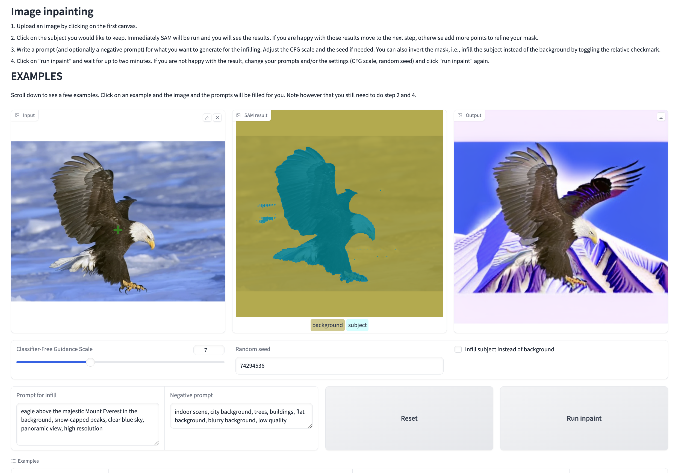

# Udacity Project - Computer Vision and GenAI

## Project: AI Photo Editing with Inpainting

### Project Overview
In this project, I built an app that allows you to select a subject and then change its background, OR keep the background and change the subject.

The process involves a user uploading an image and selecting the main object by clicking on it. The Segment Anything Model (SAM) is activated to create a mask around the selected object, choosing the most accurate mask generated. The user is shown this result to either accept it or refine the mask further with additional points. Once the mask is finalized, the user gives a text description (and possibly a negative prompt) to specify a new background for the selected object. An infill model then creates this new background, and the final image is displayed. Optionally, the user can choose to invert the mask and substitute the subject while keeping the background, as in the example above.

This little app can be used to swap backgrounds, swap subjects, remove objects, and more!

You will be writing the code that powers the main functionality of the app: calling the SAM model and processing its output, as well as using a text2image diffusion model to generate the new background or subject.

The solution to this project is implemented in the Jupyter notebook. The notebook contains the code that powers the main functionality of the app: calling the SAM model and processing its output, as well as using a text2image diffusion model to generate the new background or subject.

#### About CFG scale:

* **Low CFG (around 3–5)** The model relies more on its internal training and less on the prompt. This tends to produce more creative or unexpected results but can ignore important prompt details.

* **Mid CFG (6–8)** This range strikes a balance. The model pays attention to your prompt while still generating coherent, natural-looking images. It's usually the best choice for realistic or semi-realistic outputs, especially when the prompt is well-written.

* **High CFG (9–15)** The model follows the prompt very literally, sometimes forcing in details that reduce realism or break visual coherence. This can be useful for very specific concepts, but often comes at the cost of natural image quality.

### System Requirements
- **Hardware**: A GPU with CUDA support is recommended for efficient execution.
- **Dependencies**: Pre-installed libraries include PyTorch, Diffusers, and Gradio.

### Project Evaluation Key Points

#### Segment Anything Model (SAM)
* **Criteria:** Demonstrate proficiency in loading and utilizing the Segment Anything Model (SAM) to segment objects accurately based on user input points.
* **Submission Requirements:**
    * All `# YOUR CODE HERE` sections within the SAM part of the `project.ipynb` notebook are completed.
    * The output of the final cell in the SAM section visually confirms correct segmentation, matching the example provided (e.g., the car area is white, and the background area is green).

#### Inpainting
* **Criteria:** Demonstrate proficiency in loading and applying a pre-trained `AutoPipelineForInpainting` model from the Diffusers library for image editing based on masks and text prompts.
* **Submission Requirements:**
    * All `# YOUR CODE HERE` sections within the Inpainting part of the notebook are completed.
    * The output of the final code cell in the Inpainting section successfully displays a three-panel image: the original image, the mask used, and the final image with the specified region (e.g., background) replaced according to the prompt (e.g., a Mars landscape).

#### Interactive App Usage and Demonstration
* **Criteria:** Show understanding of the complete workflow by successfully running and using the interactive Gradio application, powered by your implemented code, to perform object segmentation and subsequent image modification (background or subject replacement) via text prompts.
* **Submission Requirements:**
    * The Gradio application cell in the notebook has been run.
    * The application was accessed (e.g., via the public URL) and tested with one or more images.
    * Evidence of successful testing is provided, either through screenshots capturing the app's interface with input/output images or by downloading and submitting the final edited image(s) generated by the app.

## Solution

### Workflow
1. **Object Segmentation**:
   - The SAM model is used to generate a segmentation mask based on user-provided points.
   - The function `get_processed_inputs` processes the image and points to create the mask.

2. **Inpainting**:
   - The inpainting pipeline replaces the background or subject based on the mask and text prompt.
   - The function `inpaint` integrates the mask, prompt, and pipeline to generate the final image.

3. **Interactive App**:
   - A Gradio-based app allows users to upload images, generate masks, and edit images interactively.

### Submission
Project 3 - [Notebook](project_3.ipynb)

#### Interactive App Usage Demonstration
The following screenshot demonstrates the interactive Gradio application in use. An image of a car was uploaded, points were used to generate a mask around the car, and a prompt was entered to change the background.

