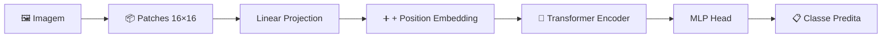
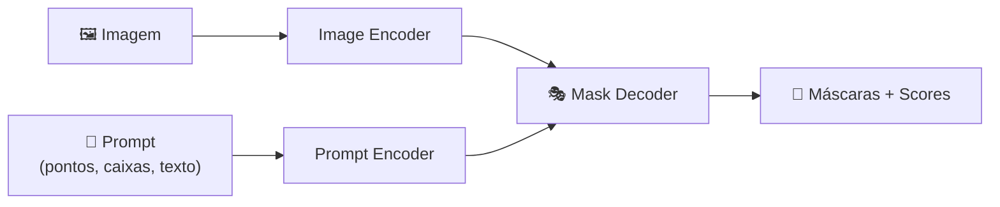

# Modelos de Visão Computacional Baseados em Transformers

### 🤖 Introdução aos Vision Transformers

Este curso oferece uma exploração aprofundada dos **Vision Transformers (ViTs)**, uma arquitetura de aprendizado de máquina que se destaca na compreensão de dados visuais. O objetivo é apresentar por que os ViTs estão revolucionando o mundo visual, estabelecendo novos padrões da indústria ao aproveitar vastas quantidades de dados e capacidade computacional.

> 💡 **Por que Transformers em Visão?** A mesma arquitetura que revolucionou o NLP agora domina a visão computacional — provando que mecanismos de atenção são universais para processamento de dados estruturados.

| Modelo | Ano | Inovação | Aplicação |
|---|---|---|---|
| **ImageGPT** | 2020 | Pixels como tokens sequenciais | Geração e compreensão (limitado a 64×64) |
| **ViT** | 2020 | Image patches 16×16 + Transformer Encoder | Classificação, detecção, segmentação |
| **DALL-E** | 2021 | CLIP encoder + Prior + Decoder | Geração texto→imagem |
| **DINOv2** | 2023 | Aprendizado autossupervisionado estudante-professor | Features visuais universais (zero-shot) |
| **SAM** | 2023 | Segmentação promptable + 1B máscaras de treinamento | Segmentação universal de qualquer objeto |

---
### 🖼️ Transformers e ImageGPT

O **ImageGPT** é um modelo que converte imagens em sequências de pixels, de forma análoga aos *tokens* de texto, adaptando *embeddings* de texto para dados visuais. Ele se destaca na interpretação de visuais complexos e é eficaz no aprendizado semissupervisionado, utilizando dados rotulados e não rotulados. No entanto, o ImageGPT exige poder computacional substancial e é limitado a uma resolução máxima de imagem de 64x64 pixels devido aos custos de tempo quadráticos associados ao processamento de sequências de pixels e *transformers*. Embora seja um modelo fundamental para os *transformers* modernos, sua utilização prática é limitada atualmente.

---
### 🏗️ Arquitetura dos Vision Transformers (ViT)

Os **Vision Transformers (ViTs)** avançam os conceitos do ImageGPT ao analisar imagens, dividindo-as em *patches* de 16x16 pixels. Estes *patches* são análogos a palavras no processamento de texto. Cada *patch* é então achatado e projetado linearmente, e essas projeções são alimentadas em um **encoder Transformer**. Este processo permite que os ViTs capturem padrões complexos e estabeleçam uma ponte entre a linguagem e a visão. Os ViTs superam os modelos de visão computacional convencionais em precisão e eficiência, necessitando de menos recursos de treinamento (até cinco vezes menos). São escaláveis e versáteis para tarefas complexas.

A arquitetura de um ViT envolve:
* A imagem é convertida em *patches* achatados e projetados linearmente.
* Cada *patch* é associado a um **embedding de posição** para manter a informação espacial.
* Os *patches* processados são então alimentados em um **encoder Transformer**.
* Finalmente, a saída do *encoder* é passada para uma **cabeça MLP (Multi-Layer Perceptron)** para classificação em categorias (ex: pássaro, bola, carro).
* Um ViT, em essência, converte uma sequência de *patches* de imagem em uma previsão de classe.



Os ViTs são empregados em diversos campos, como:
* **Imagens médicas**: detecção de tumores, análise de raios-X e ressonâncias magnéticas para identificar e delinear áreas de interesse.
* **Varejo e gestão de estoque**: classificação de produtos, detecção de anomalias.

Para mais informações, pode-se consultar o artigo:
Dosovitskiy, A., Beyer, L., Kolesnikov, A., Weissenborn, D., Zhai, X., Unterthiner, T., Dehghani, M., Minderer, M., Heigold, G., Gelly, S., Uszkoreit, J., & Houlsby, N. (2020). An image is worth 16x16 words: Transformers for image recognition at scale. arXiv preprint arXiv:2010.11929.

---
### 🔗 Geração Condicionada Multimodal

A **Geração Condicionada com ViT** é um **transformer multimodal** que integra vários tipos de dados para uma compreensão completa. É utilizada em diversas tarefas modernas, desde carros autônomos até a identificação de atividades criminosas.

Este modelo funciona da seguinte forma:
1.  Converte imagens e texto em **embeddings vetoriais**.
2.  Mescla esses *embeddings* para criar uma representação unificada de dados visuais e textuais.
3.  O **encoder de imagem** do modelo processa esses *embeddings* mesclados, extraindo relações semânticas entre elementos visuais e contexto textual através de múltiplas camadas de atenção.
4.  Utiliza **treinamento contrastivo** para alinhar os *encoders* de texto e imagem com pares relevantes, garantindo uma correspondência precisa entre texto e imagem para um desempenho eficaz em tarefas visuais-textuais.

$$\mathcal{L}_{\text{contrastivo}} = -\log\frac{\exp(\text{sim}(v_i, t_i)/\tau)}{\sum_{j=1}^{N} \exp(\text{sim}(v_i, t_j)/\tau)}$$

> A **perda contrastiva** aproxima embeddings de pares corretos (imagem-texto correspondente) e afasta pares incorretos no espaço de representação.

O treinamento contrastivo minimiza a perda entre pares de texto e imagem.

Os modelos **ViT** utilizam o mecanismo de **atenção cruzada (cross-attention)** para processar texto e dados visuais de forma eficiente:

$$\text{CrossAttention}(Q, K, V) = \text{softmax}\left(\frac{QK^T}{\sqrt{d_k}}\right)V$$

Onde $Q$ vem de uma modalidade (ex: imagem) e $K$, $V$ de outra (ex: texto). Este mecanismo permite que o modelo ajuste dinamicamente seu foco entre as modalidades de texto e imagem, dependendo do contexto e da tarefa, preservando a singularidade de cada modalidade.

O fluxo de trabalho envolve:
1.  Transformação de imagens em **vetores de *patch***.
2.  Combinação desses vetores com **embeddings de texto** para criar uma representação multimodal unificada.
3.  Processamento dessa representação por um **Encoder de Imagem** e um **Decoder de Texto**.

Esses *transformers* são versáteis e auxiliam em:
* Geração de descrição de imagens.
* Respostas a perguntas visuais (VQA - Visual Question Answering).
* Fornecimento de dados em tempo real para veículos autônomos.

Um ViT codifica imagens e as alinha com descrições textuais correspondentes. A integração multimodal de ViT processa *patches* de imagem e *embeddings* de texto em uma representação compartilhada, que é então refinada através de aprendizado contrastivo e atenção cruzada. Isso capacita o modelo a gerar interpretações ricas em contexto para tarefas complexas que combinam análise visual e textual.

---
### 🎨 DALL-E para Geração de Imagens

**DALL-E** é um modelo incrivelmente poderoso para mesclar criatividade visual com compreensão linguística, sendo capaz de gerar imagens vívidas a partir de um único *prompt* de texto. É amplamente utilizado por educadores, profissionais de marketing, artistas e designers para diversas aplicações visuais, aprimorando processos criativos e de design.

A arquitetura do DALL-E inclui:
* Um **encoder aprimorado por CLIP (Contrastive Language-Image Pre-training)** para compreensão textual. O CLIP é vital para conectar a compreensão de texto e imagem, analisando imagens no contexto do texto para associar efetivamente visuais a conceitos e palavras relacionadas.
* Um modelo **Prior** que converte as descrições de texto em *embeddings* de imagem, utilizando o *encoder* de texto do CLIP para processar semanticamente os *prompts* textuais.
* Um **decoder** que traduz esses *embeddings* de imagem na imagem final gerada.

DALL-E, portanto, gera ou modifica uma representação de desenho animado com base em entrada de texto e imagem.

---
### 🦕 DINOv2

**DINOv2** é um modelo de *vision transformer* notável que se distingue por empregar **aprendizado autossupervisionado** para codificação de características visuais. Isso permite que ele se destaque em tarefas como estimativa de profundidade, classificação de imagens e segmentação, sem a necessidade de ajuste para tarefas específicas e mesmo sem conjuntos de dados rotulados.

O modelo DINOv2 utiliza uma **arquitetura de rede estudante-professor**, que incorpora ocultamento de *patches* e atualizações de média móvel exponencial (EMA).
* A **rede "professor"** (teacher network) informa a **rede "estudante"** (student network) através de um *loop* de *feedback* da EMA.
* A rede "estudante" analisa partes cortadas da imagem, processadas por um *Vision Transformer* (ViT) e etapas de tokenização, levando à **destilação de conhecimento**.
* A atualização da EMA permite que a rede "professor" evolua lentamente, guiando o treinamento da rede "estudante" de forma mais estável.

O treinamento do DINOv2 utiliza um *dataset* de 142 milhões de imagens e processa 1.2 bilhão de imagens em seu *pipeline*, o que aprimora suas capacidades de extração de características para usos como a navegação de veículos autônomos (melhorando a detecção de obstáculos e a estimativa de profundidade).

> 🔑 **Destaque:** DINOv2 alcança resultados competitivos **sem ajuste fino** (*zero-shot*), provando que features visuais universais podem ser aprendidas sem supervisão humana.

---
### ✂️ SAM (Segment Anything Model)

O **Segment Anything Model (SAM)** é um modelo que se destaca pela sua notável capacidade de segmentar e identificar vários elementos dentro de uma imagem, independentemente da sua complexidade, oferecendo uma precisão sem precedentes na segmentação de imagens. O SAM usa *encodings* para compreender e manipular segmentos específicos dentro de uma imagem, sendo ideal para tarefas como remoção precisa de fundo em edição de fotos.



A arquitetura do SAM possui:
* Uma **Tarefa de Segmentação *Promptable*** (Promptable Segmentation Task): Isso significa que o modelo pode ser direcionado por diferentes tipos de entradas (prompts) para realizar a segmentação.
* **Encoders para *embeddings* de imagem e *prompt***:
    * O **Image Encoder** gera *embeddings* da imagem.
    * O **Prompt Encoder** utiliza um *encoder* de texto CLIP e convoluções para *prompts* esparsos (como pontos, caixas delimitadoras) e densos (como máscaras).
* Um **Mask Decoder** para segmentação: Este decoder prevê e pontua máscaras de segmentação, retornando a máscara mais precisa para manipulação detalhada da imagem. O *decoder* acomoda diversas entradas, como posições (clicando na imagem) ou segmentações automáticas.

O SAM passa por três estágios de treinamento:
1.  **Assistido-Manual**: Intervenção humana significativa.
2.  **Semi-Automático**: Redução gradual da intervenção humana.
3.  **Totalmente Automático**: Mínima ou nenhuma intervenção humana, apoiado por um motor de dados que gera máscaras de treinamento para segmentação autônoma de imagens complexas.

---

### 💻 Exemplo Prático: Classificação com ViT (HuggingFace)

```python
from transformers import ViTForImageClassification, ViTFeatureExtractor
from PIL import Image

# Load pre-trained ViT model
model = ViTForImageClassification.from_pretrained("google/vit-base-patch16-224")
extractor = ViTFeatureExtractor.from_pretrained("google/vit-base-patch16-224")

# Process an image
image = Image.open("example.jpg")
inputs = extractor(images=image, return_tensors="pt")
outputs = model(**inputs)

# Get predicted class
predicted_class = outputs.logits.argmax(-1).item()
print(f"Predicted class: {model.config.id2label[predicted_class]}")
```

> 💡 O ViT divide a imagem em patches 16×16, projeta linearmente cada patch, adiciona embeddings posicionais e processa tudo via Transformer Encoder — em apenas ~86M parâmetros para o modelo base.

---

## 🎯 Key Takeaways

- **Patches são os novos tokens:** ViTs tratam patches 16×16 de imagem como tokens de texto — unificando visão e linguagem na mesma arquitetura Transformer
- **Cross-attention é a ponte multimodal:** $\text{softmax}\left(\frac{QK^T}{\sqrt{d_k}}\right)V$ permite que modelos relacionem imagem e texto dinamicamente
- **DALL-E = CLIP + Prior + Decoder:** A geração texto→imagem combina compreensão semântica (CLIP) com decodificação visual
- **DINOv2 aprende sem rótulos:** Aprendizado autossupervisionado com arquitetura estudante-professor alcança features visuais universais
- **SAM segmenta qualquer coisa:** Segmentação promptable com treinamento em 1 bilhão de máscaras oferece generalização sem precedentes

---

[← Geração de Imagens e GANs](3_Image_Generation_and_GANs.md) · [Modelos de Difusão →](5_Diffusion_Models.md)